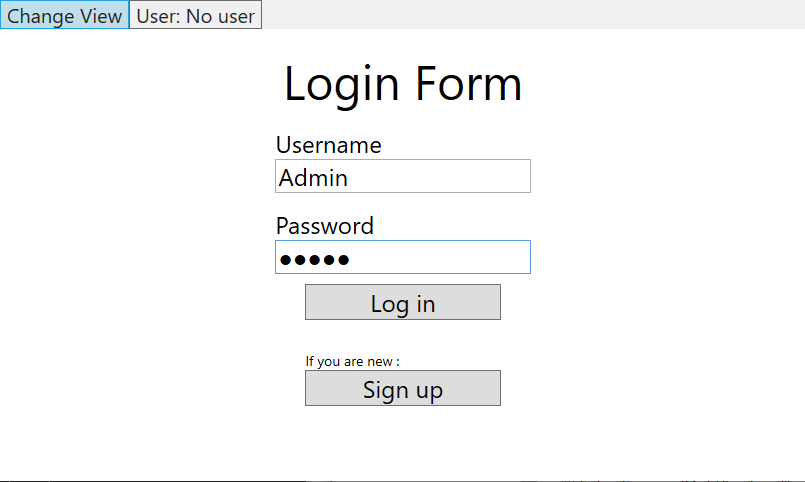
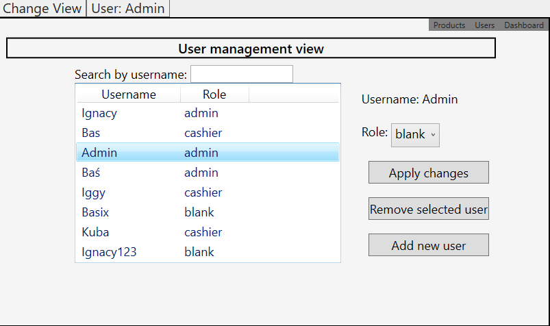
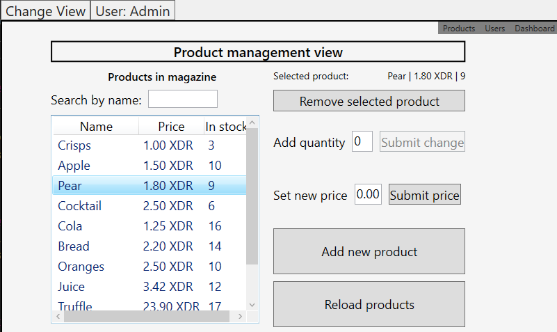
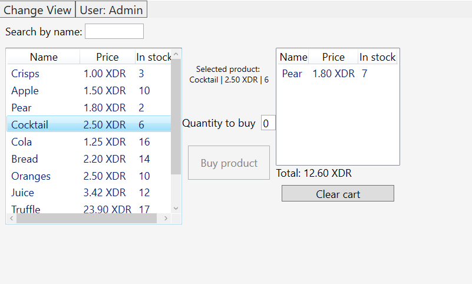

## Store Manager 
***
### Application that helps you operate your store. 
Login, administrate, sell products and organize.
***
### From the tech side
Everything is based on .Net Core WPF powered by MVVM approach. Solution is divided into three separated projects (Data, Core and UI). There is also implemented Dependency Injection principle with Autofac and the whole projects complies to it. Data (users and products) is stored in the SQLite databases inside the .Data project.    

***
### Functionalities in the app

Functionalities in app allows you to set roles for users/employees and grant them access to a different tools. On every startup you have to log in to an existing account with role attached to a person, or you can create new account, but then you have to wait until any admin assing you a proper role in store.

#### If you are logged as admin. 
- After login you will see a dashboard from which you can go to different views like User Management view or Product Management view.
 

- User Management - you can browse registered users and manage their roles in the app by scrolling list or filtering it by typing user name in search bar.  
 

- Product Management - from here you can organize your magazine, for example you can add or remove products, change their quantity or price in stock.  

#### If you are logged in as cashier.
- After login you will see a cashier dashboard which is simply a checkout tab with avaliable products which you can buy and add to cart. Of course you can also browse products list and filter it.

Download application from https://drive.google.com/drive/folders/15j7SU9rixn7Nh2wguMqOZlbXc20e5raK?usp=sharing
#### If you want to test app, you can login onto a super safe basic admin account 
Login: Admin, Password: admin

***
### Working with:
* WPF & C#
* Dependency injection
* SQLite 
* MVVM pattern 
* .Net Core 3.1
***

### NuGets
* Dapper
* SQLite.core
* CaliburnMicro
* Autofac

***
